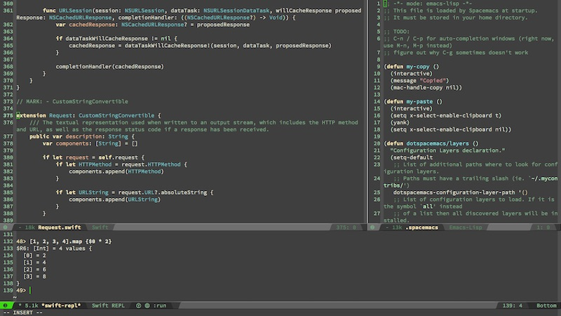

## Spacemacs Config

This is a conversion of all the good stuff from my [old and trusted emacs configuration](https://github.com/terhechte/emacs.d) to [Spacemacs](https://github.com/syl20bnr/spacemacs). Spacemacs has the very same intentions as my original config, namely a beautiful merging of Vim and Emacs. However, Spacemacs is much better than anything I could have ever made. 

The Lisp is currently a bit unstructured, but I plan on creating it out of a babel file anyway (making this Readme, then, obsolete).

I'm currently using Emacs mostly for the following things:

- Clojure/ClojureScript
- Swift (Yes, Swift, because Xcode7 is currently very very unstable)
- HTML/Javascript/CSS
- Org Mode

Enjoy
[http://twitter.com/terhechte](@terhechte)

## Obligatory Screenshot

